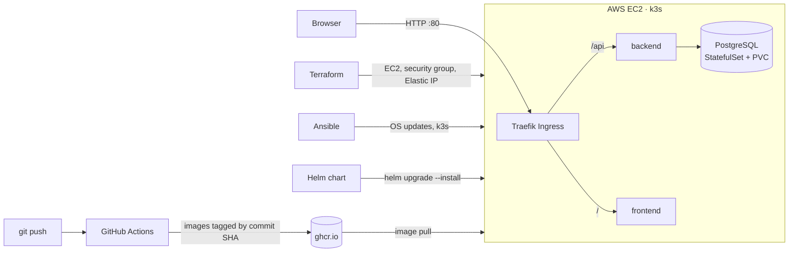
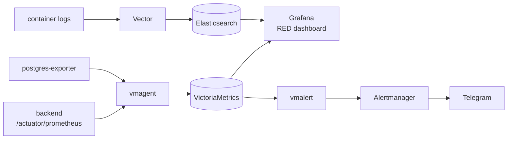

# Connect Four

**Author:** Kuryliak Oleksii

A full-stack web implementation of Connect Four, built as a university project and extended into a
production-style application with JWT authentication, a PostgreSQL-backed REST API, a React/TypeScript
frontend, and a Dockerized deployment behind Nginx.

<!-- Screenshots: add 2-3 here (game board, leaderboard, login).
     Drag images into any GitHub issue to get permanent URLs, then reference them like:
      -->

## SRE / Platform lab


Besides the game itself, this repository is a hands-on lab for infrastructure as code, Kubernetes,
observability and incident response. Everything described here is reproducible from the code in this repository.

- **Infrastructure as code:** Terraform provisions an AWS EC2 host (Ubuntu 24.04), a security group and an
  Elastic IP. Ansible upgrades the OS and installs a single-node k3s cluster.
- **CI:** GitHub Actions builds the backend and frontend images and pushes them to `ghcr.io`, tagged with the commit SHA.
- **Kubernetes:** a Helm chart deploys PostgreSQL (StatefulSet with a persistent volume), the backend
  (Deployment with startup, liveness and readiness probes and resource limits) and the frontend, behind a Traefik Ingress.
- **Observability (Docker Compose):** vmagent scrapes Spring Boot Actuator and a PostgreSQL exporter into
  VictoriaMetrics; a Grafana RED dashboard is provisioned as code; vmalert rules send alerts through Alertmanager
  to Telegram; container logs are shipped with Vector to Elasticsearch.
- **Incident response:** a simulated database outage with a runbook and a postmortem, follow-up fixes verified
  on Kubernetes, and a failed rollout recovered with `helm rollback`.

### Architecture

Deployment to Kubernetes:



Observability stack (`docker-compose.observability.yml`):



### Repository layout

| Path | What |
|---|---|
| `infra/terraform/` | AWS EC2 host, security group (SSH and Kubernetes API only from the operator's IP), Elastic IP; generates the Ansible inventory |
| `infra/ansible/` | `common.yml` (OS upgrade, base packages, reboot if required) and the `k3s` role; fetches the kubeconfig |
| `helm/connect4/` | Helm chart: PostgreSQL, backend, frontend, Ingress |
| `.github/workflows/images.yml` | Builds and pushes the backend and frontend images |
| `docker-compose.observability.yml`, `observability/` | Metrics, dashboards, alert rules, Alertmanager, log shipping |
| `docs/` | Runbook, postmortems and raw incident notes |

### Run it

Kubernetes on AWS (needs an AWS CLI profile and an SSH key pair at `~/.ssh/connect4-lab`):

```bash
# 1. Server
cd infra/terraform && terraform init && terraform apply

# 2. OS setup and k3s; writes the kubeconfig to ~/.kube/connect4-lab.yaml
cd ../ansible && ansible-playbook site.yml

# 3. Application (from the repository root)
cd ../..
export KUBECONFIG=~/.kube/connect4-lab.yaml
helm upgrade --install c4 helm/connect4 -f helm/values-secret.yaml

# 4. Open the game
echo "http://$(terraform -chdir=infra/terraform output -raw public_ip)"

# Tear down
terraform -chdir=infra/terraform destroy
```

`helm/values-secret.yaml` is not in git. It sets `postgres.password` and `backend.jwtSecret`
(base64url, for example `openssl rand -base64 48 | tr '+/' '-_' | tr -d '='`).

Observability stack locally (Telegram bot token in `observability/alertmanager/secrets/telegram_token`,
not in git; chat ID in `observability/alertmanager/alertmanager.yml`):

```bash
docker compose -f docker-compose.yml -f docker-compose.observability.yml up -d \
  db backend victoriametrics vmagent postgres-exporter grafana vmalert alertmanager elasticsearch vector
```

Grafana runs on `:3000`, VictoriaMetrics on `:8428`, vmalert on `:8880`, Alertmanager on `:9093`,
Elasticsearch on `:9200`.

### Incidents and runbooks

- [PostgreSQL outage (simulated)](docs/postmortems/2026-10-01-postgres-outage.md): the `PostgresDown` alert
  reached Telegram 73 s after the database stopped. Follow-up fixes (DB in the readiness probe, 3 s connection
  timeout) were verified on Kubernetes.
- [Runbook: PostgresDown](docs/runbooks/postgres-down.md)
- [Failed rollout: non-existent image tag](docs/postmortems/2026-10-06-frontend-bad-image-rollout.md): the
  rolling update kept the old pod serving traffic; recovered with `helm rollback`.

Issues found while building the lab:

- `postgres:latest` became PostgreSQL 18, which stores data under `/var/lib/postgresql`; the old volume path
  silently left data in an anonymous volume. The image is now pinned.
- A missing request parameter returned 403 to the client while metrics recorded 400: the error was forwarded
  to `/error`, which Spring Security blocked.
- Elasticsearch rejected every log event because two Docker labels (`com.docker.compose.project` and
  `com.docker.compose.project.config_files`) produced a mapping conflict; Vector now drops the labels.
- The readiness probe stayed `UP` while the database was down, so Kubernetes would have kept routing traffic
  to a broken pod.

## Table of Contents
0.  [SRE / Platform lab](#sre--platform-lab)
1.  [Introduction](#introduction)
2.  [Features](#features)
3.  [Technologies Stack](#technologies-stack)
    *   [Backend](#backend)
    *   [Frontend](#frontend)
    *   [Database](#database)
    *   [DevOps & Deployment](#devops--deployment)
4.  [Project Structure](#project-structure)
5.  [Getting Started](#getting-started)
    *   [Prerequisites](#prerequisites)
    *   [Running Locally](#running-locally)
6.  [API Overview](#api-overview)
7.  [Deployment](#deployment)

## Introduction
This project is a web-based implementation of the classic game "Connect Four". Users can register, log in, play Connect Four against other players online, view leaderboards, comment on the game, and rate it. The application is designed with a modern, responsive user interface and a robust backend.

## Features
*   User authentication (registration and login) with JWT.
*   Online multiplayer Connect Four gameplay (client polling for game-state sync).
*   Game lobbies for finding opponents.
*   Score tracking and leaderboards (MMR-based and win-based).
*   Game rating system.
*   Commenting system for the game.
*   Player statistics.
*   Responsive design for various screen sizes.

## Technologies Stack

### Backend
*   **Language:** Java 17+
*   **Framework:** Spring Boot 3.x
    *   Spring Web: For building RESTful APIs.
    *   Spring Data JPA: For database interaction.
    *   Spring Security: For authentication and authorization using JWT.
*   **ORM:** Hibernate
*   **Build Tool:** Apache Maven
*   **API Documentation:** OpenAPI 3 via springdoc (`springdoc-openapi-starter-webmvc-ui`). Swagger UI is served at `/swagger-ui/index.html` and the OpenAPI spec at `/v3/api-docs`.

### Frontend
*   **Language:** TypeScript
*   **Framework/Library:** React 18.x
*   **Build Tool/Bundler:** Vite
*   **Styling:**
    *   Tailwind CSS: Utility-first CSS framework.
    *   Shadcn/ui: Re-usable UI components.
*   **State Management:** React Context API, TanStack Query (React Query) for server state.
*   **Routing:** `react-router-dom` (see `src/App.tsx`, `src/main.tsx`, and `src/components/PrivateRoute.tsx`).

### Database
*   **Type:** PostgreSQL (relational database)

### DevOps & Deployment
*   **Containerization:** Docker
*   **Orchestration:** Docker Compose (for local development and multi-container setup)
*   **Web Server/Reverse Proxy:** Nginx (serving frontend static files and proxying API requests to the backend)
*   **Cloud Platform:** Google Cloud Platform (GCP) - Deployed on a Compute Engine virtual instance.

## Project Structure
The workspace is organized into several main directories:

*   `backend/`: Contains the Java Spring Boot application.
    *   `src/main/java/sk/tuke/gamestudio/`: Main application code.
        *   `entity/`: JPA entities.
        *   `repository/`: Spring Data JPA repositories.
        *   `service/`: Business logic and service layers (including JPA and potentially older RestClient/JDBC implementations).
        *   `security/`: Spring Security configuration, JWT filter.
        *   `server/controller/`: REST API controllers.
        *   `game/connectfour/`: Core game logic for Connect Four (console version might be present).
    *   `src/main/resources/`: Configuration files like `application.properties`.
    *   `pom.xml`: Maven project configuration.
    *   `Dockerfile`: For building the backend Docker image.
*   `frontend/`: Contains the TypeScript React application.
    *   `src/`: Main source code.
        *   `components/`: Reusable React components (including `ui/` for Shadcn components).
        *   `pages/`: Top-level page components.
        *   `services/`: API client logic.
        *   `context/`: React context for state management (e.g., AuthContext).
        *   `hooks/`: Custom React hooks.
        *   `lib/`: Utility functions.
        *   `main.tsx`: Application entry point.
        *   `App.tsx`: Root application component.
    *   `public/`: Static assets.
    *   `package.json`: NPM project configuration and dependencies.
    *   `vite.config.ts`: Vite configuration.
    *   `tailwind.config.ts`: Tailwind CSS configuration.
    *   `Dockerfile`: For building the frontend Docker image.
*   `database/`: Contains PostgreSQL setup.
    *   `Dockerfile`: For the PostgreSQL Docker image.
    *   `init.sql`: Database initialization script.
*   `diagram/`: Contains project diagrams (class diagrams, sequence diagrams, etc.).
*   `docker-compose.yml`: Defines and orchestrates the `backend`, `frontend`, and `db` services.
*   `nginx.conf`: Nginx configuration file, typically used as a reverse proxy.
*   `README.md`: This file.

## Getting Started

### Prerequisites
*   Docker: [Install Docker](https://docs.docker.com/get-docker/)
*   Docker Compose: Usually comes with Docker Desktop. If not, [Install Docker Compose](https://docs.docker.com/compose/install/)
*   A web browser (e.g., Chrome, Firefox, Edge)

### Running Locally
1.  **Clone the repository and navigate to the root directory.**
2.  **Create your environment file from the template and fill in the values:**
    ```bash
    cp .env.example .env
    ```
    All services read their configuration from `.env`. Set the database credentials (`POSTGRES_USER`,
    `POSTGRES_PASSWORD`), a JWT signing secret (`JWT_SECRET`), and the frontend API URL (`VITE_API_URL`).
    Generate a strong JWT secret with:
    ```bash
    openssl rand -base64 64 | tr -d '\n'
    ```
3.  **Build and run the application using Docker Compose:**
    ```bash
    docker compose up --build -d
    ```
    The `-d` flag runs the containers in detached mode. The frontend image is built with
    [Bun](https://bun.sh/) (see `frontend/Dockerfile`).
4.  **Access the application:**
    *   Frontend: `http://localhost` (Nginx listens on port 80).
    *   Backend API: `http://localhost:8080`, with Swagger UI at `http://localhost:8080/swagger-ui/index.html`.

## API Overview
The backend exposes RESTful APIs for various functionalities. Key services include:

*   **Authentication (`/api/connect4/auth/`)**:
    *   User registration (`/register`)
    *   User login (`/login`)
*   **Score (`/api/score/`)**:
    *   Add score (POST, authenticated)
    *   Get top scores for a game (GET `/{game}`)
    *   Reset scores for a game (DELETE `/{game}`, admin only)
*   **Rating (`/api/connect4/rating/`)**:
    *   Get average rating for a game (GET `/average?game={gameName}`)
    *   Get user's rating for a game (GET `/my-rating?game={gameName}`, authenticated)
    *   Set/update rating for a game (POST, authenticated)
    *   Delete user's rating for a game (DELETE `?game={gameName}`, authenticated)
*   **Comment (`/api/connect4/comment/`)**:
    *   Get comments for a game (GET `?game={gameName}`)
    *   Add a comment (POST, authenticated)
    *   Delete a comment (DELETE `/{commentId}`, authenticated, user must own comment or be admin)
    *   Clear all comments for a game (DELETE `?game={gameName}`, admin only)
*   **Player Statistics (`/api/connect4/leaderboard/`)**:
    *   Get leaderboard (GET `?game={gameName}&sortBy={mmr|wins}&limit={limit}`)
    *   Get player stats (GET `/player/{username}?game={gameName}`, authenticated)
    *   Reset player stats (DELETE `/player/{username}?game={gameName}`, admin only)
    *   Reset all player stats for a game (DELETE `?game={gameName}`, admin only)
*   **Game (`/api/connect4/game/`)**:
    *   Create new game session (POST `/create`, authenticated)
    *   Get game state (GET `/{gameSessionId}`, authenticated)
    *   Make a move (POST `/{gameSessionId}/move`, authenticated)
    *   Forfeit game (POST `/{gameSessionId}/forfeit`, authenticated)
*   **Lobby (`/api/connect4/lobby/`)**:
    *   Endpoints for managing game lobbies, finding opponents, etc. (specifics depend on implementation).

*(Note: Some API paths like `/api/score/` seem to use a different base path than `/api/connect4/`. This is based on the provided controller configurations.)*

## Deployment
The Kubernetes deployment on AWS (Terraform, Ansible, k3s, Helm) is described in [SRE / Platform lab](#sre--platform-lab).

The original deployment ran on a **Google Cloud Platform (GCP) Compute Engine virtual instance**.
All services run as Docker containers defined in `docker-compose.yml` (backend, frontend, database), with
Nginx as the reverse proxy: it serves the frontend static files and proxies API requests to the backend.
The `nginx.conf` file defines this routing.